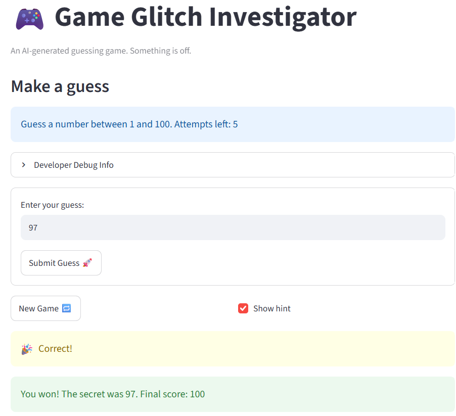

# 🎮 Game Glitch Investigator: The Impossible Guesser

## 🚨 The Situation

You asked an AI to build a simple "Number Guessing Game" using Streamlit.
It wrote the code, ran away, and now the game is unplayable. 

- You can't win.
- The hints lie to you.
- The secret number seems to have commitment issues.

## 🛠️ Setup

1. Install dependencies: `pip install -r requirements.txt`
2. Run the broken app: `python -m streamlit run app.py`

## 🕵️‍♂️ Your Mission

1. **Play the game.** Open the "Developer Debug Info" tab in the app to see the secret number. Try to win.
2. **Find the State Bug.** Why does the secret number change every time you click "Submit"? Ask ChatGPT: *"How do I keep a variable from resetting in Streamlit when I click a button?"*
3. **Fix the Logic.** The hints ("Higher/Lower") are wrong. Fix them.
4. **Refactor & Test.** - Move the logic into `logic_utils.py`.
   - Run `pytest` in your terminal.
   - Keep fixing until all tests pass!

## 📝 Document Your Experience

- Describe the game's purpose.
   - The game is a random number guessing game, users can pick the difficulty (range of numbers you can guess), then you have a set amount of guesses to get the right one. The game also gives you hints whether your guess is too high or too low. When you get the right one, balloons come out and you win the game.
- Detail which bugs you found.
   - Submit button doesn't work right away, you have to submit twice
   - New game button doesn't fully reset the game, only changes the secret number
   - Hint messages are the opposite of what it should be
- Explain what fixes you applied.
   - Made a fix that updates the initial state of the submissions counter, removed a code block that turns the secret into a string
   - Initialize some variables (session status, history) so they're back to their starting state (playing, empty list)
   - Swap out "Go HIGHER" and "Go LOWER"

## 📸 Demo Walkthrough

Describe your fixed game in numbered steps so a reader can follow along without watching a video:

1. User enters 90 into input box
2. Message below says "Go HIGHER!"
3. User enters 100 into input box
4. Message below says "Go LOWER!"
5. User enters 97 into input box
6. Balloons pop up, message below says "You won! The secret was 97. Final score: 100"

**Screenshot** *(optional)*: <!-- Insert a screenshot of your fixed, winning game here -->


## 🧪 Test Results

```
# Paste your pytest output here, e.g.:
# pytest tests/
# ========================= X passed in 0.XXs =========================
```

## 🚀 Stretch Features

- [ ] [If you choose to complete Challenge 4, describe the Enhanced UI changes here — a screenshot is optional]
